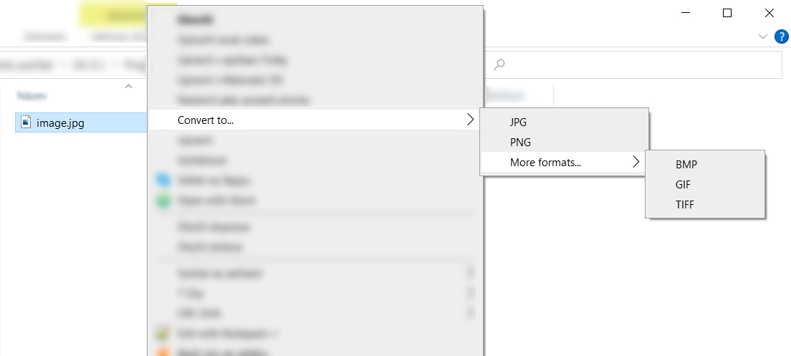

# ConWinTer
Console Windows Converter (or ConWinTer for short) is a commandline application for converting files from one format to another. Main focus is on image files but other types will be considered. ConWinTer is capable of converting __svg__ file to png and other.

This repo also provides a .reg file that adds support for converting files just by right-clicking a file and selecting output format. For more information see [Explorer context menu](#explorer-context-menu) section.

The core functionality i.e. converting files is __cross-platform__ only mentioned right-click conversion feature is Windows only.

## Usage 
ConWinTer supports a few options for specifying input and output. Run `ConWinTer.exe --help` for more infomation.

### Image options
 1. `-i`, `--input` `<path>` is a __required__ option taking one argument. Argument is a path to image that should be converted. Image format is deduced from path extension (supported extensions are listed below).
 2. `-o`, `--output` `<path>` is a non-mandatory option taking one argument. Argument is a target path for image output. When `-f` or `--output-format` is not specified then image format is deduced from path extension. If this option is omitted then target path is same as input path with extension specified by `--output-format`.
 3. `-f`, `--output-format` `<format>` is a non-mandatory option taking one argument. Argument is a format that should be used as an output (supported formats/extensions are listed below).

### Supported extensions
Different extensions are supported as input and output

__Input__: ___.png___, ___.jpg___, _.bmp_, _.gif_, _.dib_, _.tif_, _.tiff_, ___.ico___, ___.svg___, _.ppm_, _.pgm_, _.pbm_

__Output__: ___.png___, ___.jpg___, _.bmp_, _.gif_, _.dib_, _.tif_, _.tiff_, ___.ico___

### Examples

__Example 1:__

`ConWinTer.exe --input C:\Images\image.jpg --output C:\Documents\converted.png`

Converts image located at `C:\Images\image.jpg` to png and saves it to `C:\Documents\converted.png`.

__Example 2:__

`ConWinTer.exe -i C:\Images\image.jpg -o C:\Documents\converted.png`

Does same operation as __Example 1__ but it uses shorter notation.

__Example 3:__

`ConWinTer.exe --input C:\Images\image.jpg --output-format png`

Converts image located at `C:\Images\image.jpg` to png and saves it to same directory as source image (`C:\Images\image.png`).

__Example 4:__

`ConWinTer.exe -i C:\Images\image.jpg -f png`

Does same operation as __Example 3__ but it uses shorter notation.

## Explorer context menu

For faster and easier use via the File Explorer Context Menu (right-click menu) this repo contains `context_menu.reg` file. 

__This feature is Windows only and was tested on a Windows 10 machine.__

### Setup
 * Add path to `ConWinTer.exe` inside `PATH` environment variable. _For example if the exe file is in `C:\ConWinTer\ConWinTer.exe` then `C:\ConWinTer` should be added to `PATH` environment variable._
 * Run (simply by double-clicking) `context_menu.reg` file. This will ask for admin privileges and add file associations to registry.

If you setup everything correctly then all files ending with an extension that is supported as input will show menu for converting on right-click.

## License
Licensed under the MS-PL license.

This project has dependencies on other open-source projects. These projects are referenced via NuGet packages and might be subject to different licenses.

|Project|Author|Sources|License|
|-------|------|-------|-------|
|SVG.NET|svg-net|[GitHub](https://github.com/svg-net/SVG)|[MS-PL](https://github.com/svg-net/SVG/blob/master/license.txt)|
|command-line-api|dotnet|[GitHub](https://github.com/dotnet/command-line-api)|[MIT](https://github.com/dotnet/command-line-api/blob/main/LICENSE.md)|
